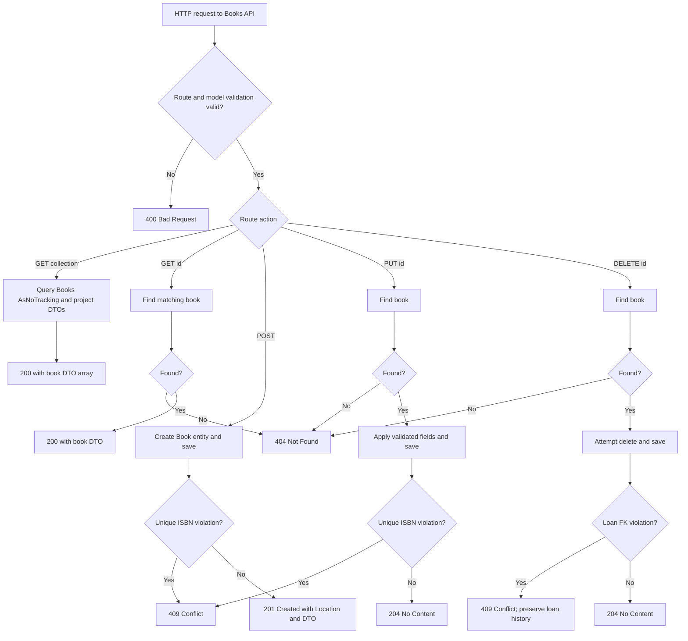
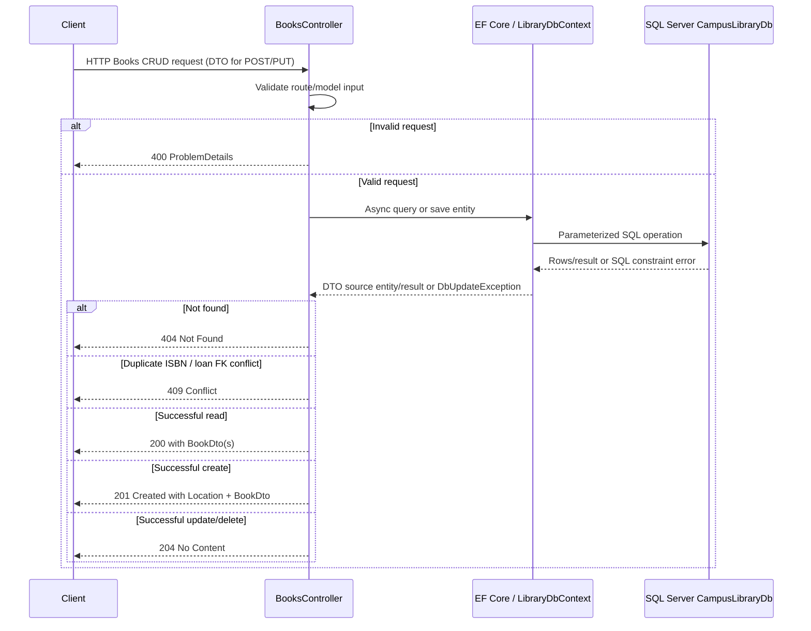

# Flowcharts — Books API

## Feature Logic

```mermaid
flowchart TD
    A[HTTP request to Books API] --> B{Route and model validation valid?}
    B -->|No| C[400 Bad Request]
    B -->|Yes| D{Route action}
    D -->|GET collection| E[Query Books AsNoTracking and project DTOs]
    E --> F[200 with book DTO array]
    D -->|GET id| G[Find matching book]
    G --> H{Found?}
    H -->|No| I[404 Not Found]
    H -->|Yes| J[200 with book DTO]
    D -->|POST| K[Create Book entity and save]
    K --> L{Unique ISBN violation?}
    L -->|Yes| M[409 Conflict]
    L -->|No| N[201 Created with Location and DTO]
    D -->|PUT id| O[Find book]
    O --> P{Found?}
    P -->|No| I
    P -->|Yes| Q[Apply validated fields and save]
    Q --> R{Unique ISBN violation?}
    R -->|Yes| M
    R -->|No| S[204 No Content]
    D -->|DELETE id| T[Find book]
    T --> U{Found?}
    U -->|No| I
    U -->|Yes| V[Attempt delete and save]
    V --> W{Loan FK violation?}
    W -->|Yes| X[409 Conflict; preserve loan history]
    W -->|No| Y[204 No Content]
```

## API/Database Sequence

```mermaid
sequenceDiagram
    participant Client
    participant Controller as BooksController
    participant EF as EF Core / LibraryDbContext
    participant SQL as SQL Server CampusLibraryDb

    Client->>Controller: HTTP Books CRUD request (DTO for POST/PUT)
    Controller->>Controller: Validate route/model input
    alt Invalid request
        Controller-->>Client: 400 ProblemDetails
    else Valid request
        Controller->>EF: Async query or save entity
        EF->>SQL: Parameterized SQL operation
        SQL-->>EF: Rows/result or SQL constraint error
        EF-->>Controller: DTO source entity/result or DbUpdateException
        alt Not found
            Controller-->>Client: 404 Not Found
        else Duplicate ISBN / loan FK conflict
            Controller-->>Client: 409 Conflict
        else Successful read
            Controller-->>Client: 200 with BookDto(s)
        else Successful create
            Controller-->>Client: 201 Created with Location + BookDto
        else Successful update/delete
            Controller-->>Client: 204 No Content
        end
    end
```
