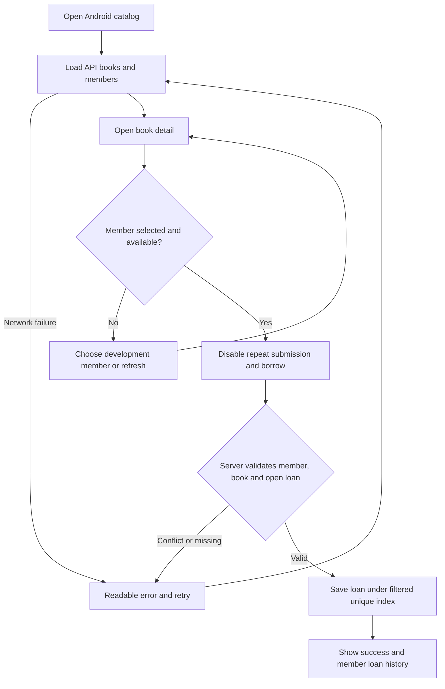
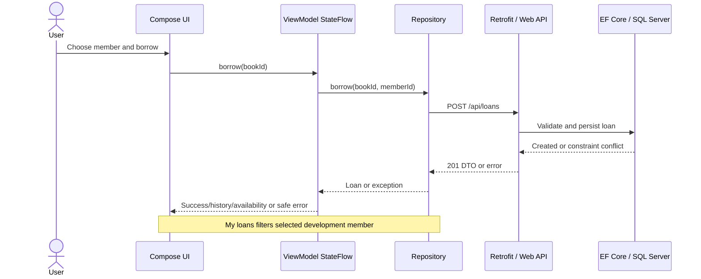
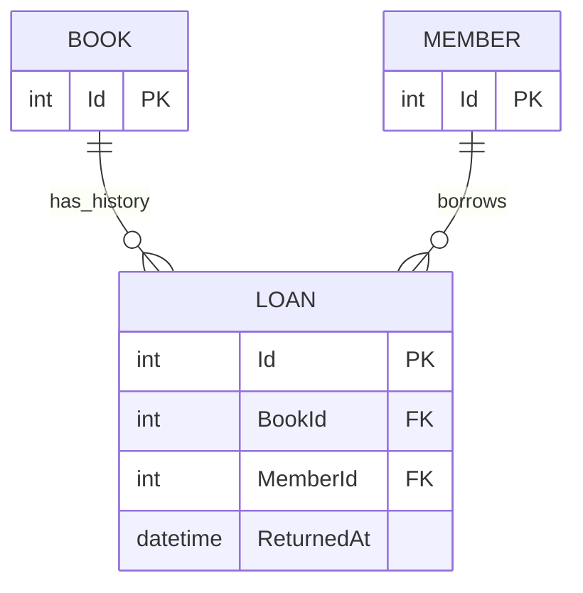

# Feature logic

```mermaid
flowchart TD
    A[Open Android catalog] --> B[Load API books and members]
    B -->|Network failure| C[Readable error and retry]
    C --> B
    B --> D[Open book detail]
    D --> E{Member selected and available?}
    E -->|No| F[Choose development member or refresh]
    F --> D
    E -->|Yes| G[Disable repeat submission and borrow]
    G --> H{Server validates member, book and open loan}
    H -->|Conflict or missing| C
    H -->|Valid| I[Save loan under filtered unique index]
    I --> J[Show success and member loan history]
```

```mermaid
sequenceDiagram
    actor User
    participant UI as Compose UI
    participant VM as ViewModel StateFlow
    participant Repo as Repository
    participant API as Retrofit / Web API
    participant DB as EF Core / SQL Server
    User->>UI: Choose member and borrow
    UI->>VM: borrow(bookId)
    VM->>Repo: borrow(bookId, memberId)
    Repo->>API: POST /api/loans
    API->>DB: Validate and persist loan
    DB-->>API: Created or constraint conflict
    API-->>Repo: 201 DTO or error
    Repo-->>VM: Loan or exception
    VM-->>UI: Success/history/availability or safe error
    Note over UI,Repo: My loans filters selected development member
```

Logical EF relationship corrected; physical SQL schema unchanged:

```mermaid
erDiagram
    BOOK ||--o{ LOAN : has_history
    MEMBER ||--o{ LOAN : borrows
    BOOK { int Id PK }
    MEMBER { int Id PK }
    LOAN { int Id PK
 int BookId FK
 int MemberId FK
 datetime ReturnedAt }
```
